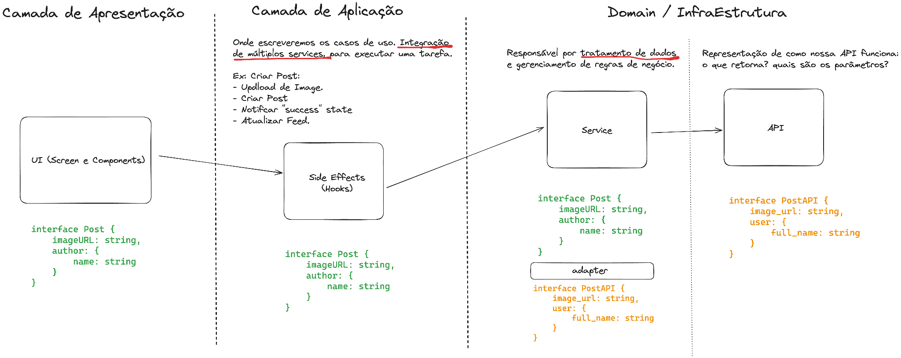
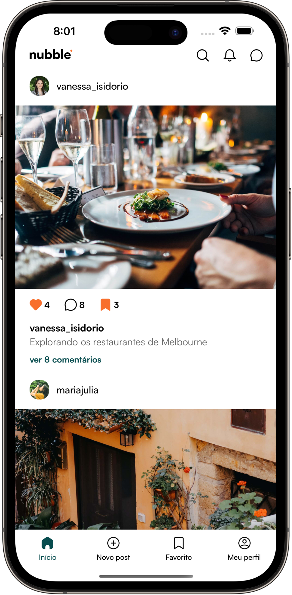
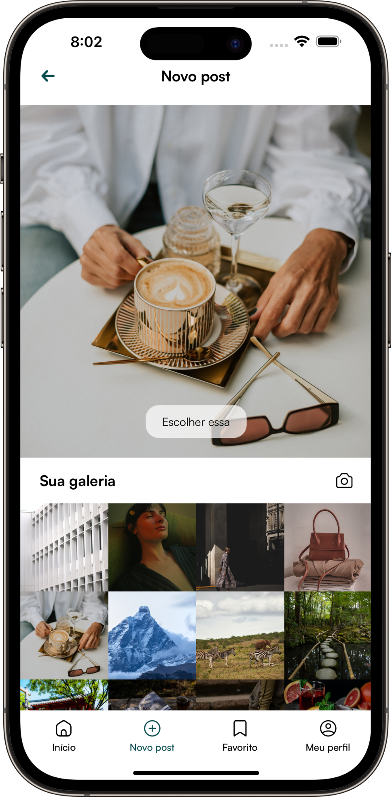

# 📱 Nubble App

Bem-vindo ao repositório do **Nubble App**, projeto desenvolvido no curso **PRN (Profissional React Native)**.
O objetivo do app é simular uma rede social moderna, aplicando **boas práticas de mercado** com **arquitetura limpa**, **integração com backend**, **testes automatizados** e **pipelines de CI/CD** com **Fastlane** e **GitHub Actions**.

---

## 🚀 Funcionalidades

* 👤 **Autenticação de Usuário** (login, cadastro e recuperação de senha)
* 🖼️ **Postagens com fotos** (upload e feed dinâmico)
* ❤️ **Curtir, comentar e favoritar posts**
* 📂 **Gerenciamento de favoritos**
* 👨‍💻 **Edição de perfil com foto e informações pessoais**
* 📱 **Feed de posts interativo**

---

## ⛏️ Tech (Bibliotecas e Tecnologias)

* **React Native CLI**
* **TypeScript**
* **Jest** + **React Native Testing Library** (testes unitários)
* **CI/CD** com **Fastlane** e **GitHub Actions**
* **React Hook Form** + **Zod** (validações)
* **Zustand** (state management)
* **TanStack Query (React Query)**
* **React Native MMKV** (armazenamento local performático)
* **Shopify Restyle** (estilização tipada)
* **React Navigation**
* **EsLint, Prettier e Husky** (qualidade de código)
* **React Native Vision Camera** (câmera nativa)

---

## 🏗️ Arquitetura do Projeto

O Nubble App segue **Clean Architecture + SOLID + MVVM (Model-View-ViewModel)**, visando:

* Separação clara entre **UI**, **Aplicação**, **Domínio** e **Infraestrutura**
* Código **escalável** e **fácil de manter**
* Adoção de **design patterns** para melhor organização

### 🔎 Fluxo de Camadas



---

## 📸 Screenshots

| Feed                                     | Novo Post                                     | Favoritos                                     | Perfil                                     |
| ---------------------------------------- | --------------------------------------------- | --------------------------------------------- | ------------------------------------------ |
|  |  |  |  |

| Login                                     | Recuperação de Senha                                | Edição de Perfil                                  | Post Detalhe                             |
| ----------------------------------------- | --------------------------------------------------- | ------------------------------------------------- | ---------------------------------------- |
|  |  |  |  |

---

## ⚙️ Como Rodar o Projeto

### 📌 Pré-requisitos

* **Node.js >= 18**
* **NPM**
* **Android Studio** configurados para emuladores

### 📥 Passos

```bash
# 1. Clone o repositório
git clone https://github.com/GabrielBursi/NubbleApp.git
cd nubble-app

# 2. Instale as dependências
npm install

# 3. Rodar Metro Bundler
npm start

# 4. Rodar no Android
npm run dev
```

### 🧪 Rodando Testes

```bash
# Executa todos os testes
npm run test
```

---

## 🔗 CI/CD

* **GitHub Actions** configurado para rodar testes e validação de código
* **Fastlane** para build e deploy automatizado

---

## 📚 Aprendizados do Curso

Durante o desenvolvimento do Nubble App, foram trabalhados:

* Arquitetura limpa aplicada a apps React Native
* Integração com backend real
* Gerenciamento de estado avançado
* Testes automatizados
* Configuração de pipelines de entrega contínua
* Publicação em App Store e Google Play (via Fastlane)

---

## 👨‍💻 Autor

Projeto construído no curso **Profissional React Native (PRN)** by Coffstack.
Mais informações: [Coffstack](https://coffstack.com)
